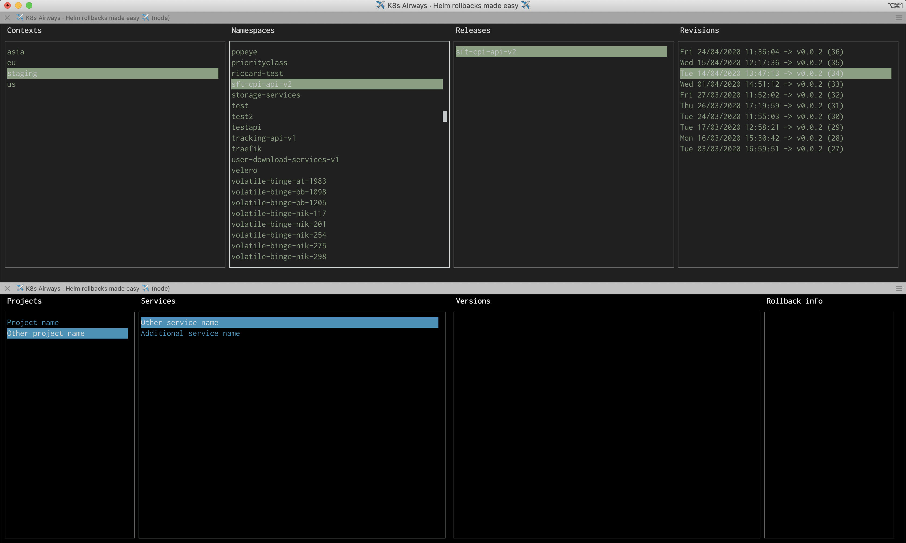

# K8s Airways

A terminal application to make Helm rollbacks easy.



## ✈️  Requirements

- [Node.js](https://nodejs.org/) >= 10
- [Helm](https://helm.sh/) >= 3
- [kubectl](https://kubernetes.io/docs/reference/kubectl/overview)

## ✈️  Installation & launch

### Using npx

```shell
npx k8s-airways -c [optional projects config]
```

### Using npm

```shell
npm install -g k8s-airways
k8s-airways -c [optional projects config]
```

### Cloning the repository

```shell
git clone https://github.com/mawrkus/k8s-airways.git
cd k8s-airways
npm install
npm run start
```

or

```shell
npm run start:projects
```

## ✈️  Usage

⚠️ **BE CAREFUL: once clicked on the revision in the last column, the rollback will be triggered without any confirmation.**

- Without providing a config file for your projects, you can browse:

  **contexts** -> **namespaces** -> **releases** -> **revisions**

- When providing a config file, you can browse:

  **projects** -> **releases** -> **revisions**

If the repository was cloned, you can configure your project(s) in `./config/k8s-demo-projects.json`.

### The config file

It's a simple JSON file containing an entry for each project, e.g.:

```json
{
  "Project name": {
    "contexts": ["europe", "usa", "asia"],
    "releases": {
      "My service name": "my-namespace:my-release",
      "My other service name": "my-other-namespace:my-other-release"
    },
    "maxRevisionsPerContext": 3
  },
  "Other project name": {
  }
}
```

## ✈️  Contribute

1. Fork it: `git clone https://github.com/mawrkus/k8s-airways.git`
2. Create your feature branch: `git checkout -b feature/my-new-feature`
3. Commit your changes: `git commit -am 'Added some feature'`
4. Check the tests: `npm run test`
5. Push to the branch: `git push origin my-new-feature`
6. Submit a pull request :D
